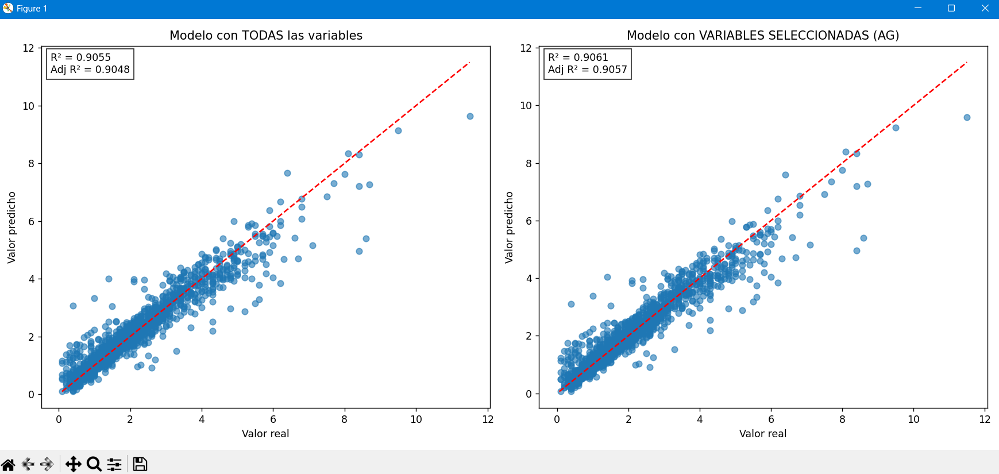
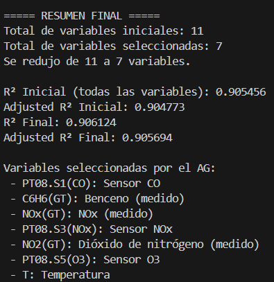

# 🧬 Genetic Algorithm for Data Mining / Regression

This project implements a **Genetic Algorithm (GA)** to solve **data mining problems**, such as:  
- Feature selection  
- Linear and non-linear regression model fitting  
- Hyperparameter optimization  

It includes scripts to prepare data, execute the genetic algorithm, and evaluate the results.

---
## 🖼️ Results

> Click any thumbnail to view full-size.

### Results (example)
[](img/results.png)  

### Selected Variables (example)
[](img/selected_variables.png)  

---

## 📂 Contents

- `Mineria_Datos_AlgGenetico/`
  - `Algoritmos/`
  - `__pycache__/`
  - `inputacion_datos.py`
  - `regresion_lineal_mult_mineria_datos.py`
  - `Datasets/`
    - `AirQuality.csv`
    - `AirQuality_imputed_iterative.csv`
    - `Boston-house-price-data.csv`
  - `img/`
  - `.gitignore`
  - `README.md`

> Repo: https://github.com/topclutch/Alggenreglin/tree/main/Mineria_Datos_AlgGenetico
---

## ⚙️ Features

- **Modular implementation** of a Genetic Algorithm (GA)  
- Representation of **individuals (chromosomes)** for regression and/or feature selection problems  
- Genetic operators: **selection**, **crossover**, **mutation**, and **replacement**  
- Evaluation using metrics such as `MSE`, `RMSE`, and `R²`  
- Support for experimentation with different parameters: population size, number of generations, mutation rate, etc.

---

## 🧩 Requirements

- Python **3.8+** (recommended)
- Main libraries: `numpy`, `pandas`, `scikit-learn`, `matplotlib`, `tqdm`  

Example of a minimal `requirements.txt`:

```txt
numpy
pandas
scikit-learn
matplotlib
tqdm
